# LE Audio Player (LEPL)

## Table of Contents
- [Overview](#overview)
- [Features](#features)
- [Hardware Requirements](#hardware-requirements)
- [Software Requirements](#software-requirements)
- [Getting Started](#getting-started)
- [Usage Instructions](#usage-instructions)
- [Configuration Parameters](#configuration-parameters)
- [Application Architecture](#application-architecture)
- [Troubleshooting](#troubleshooting)
- [NVRAM Data Storage](#nvram-data-storage)
- [Performance Characteristics](#performance-characteristics)
- [Audio Transcoding Mode](#audio-transcoding-mode)
- [More Information](#more-information)
- [License](#license)

## Overview
This application demonstrates a Bluetooth LE Audio Player/Source implementation using the AIROC&#8482; Bluetooth stack.
It acts as an audio source device that transmits audio streams to LE Audio sinks (for example, LE Audio headset/earbuds) using the Generic Audio Framework (GAF).

The application supports both Unicast Source (point-to-point streaming) and Broadcast Source (Auracast&#8482; transmission) roles as defined by the Bluetooth LE Audio specifications.

## Features

### Supported Roles
- **Unicast Source**: Transmits audio streams to a unicast sink (for example, LE Audio headset)
- **Broadcast Source**: Transmits audio broadcasts (Auracast&#8482;), including encrypted streams

### Supported Audio Profiles
| Profile | Description |
| :--- | :--- |
| **BAP** | Basic Audio Profile: core audio streaming (Unicast/Broadcast Source roles) |
| **CAP** | Common Audio Profile: coordinated audio behaviors across devices |
| **TMAP** | Telephony and Media Audio Profile (Call Gateway, Unicast/Broadcast Media Sender) |
| **GMAP** | Gaming Audio Profile: low-latency gaming audio (UGG role) |
| **HAP** | Hearing Access Profile: hearing aid preset management (client) |

### Supported GATT Services
| Service | Acronym | Purpose |
| :--- | :--- | :--- |
| **Published Audio Capabilities Service** | PACS | Client: discovers headset audio codec capabilities |
| **Audio Stream Control Service** | ASCS | Client: controls stream setup on headset devices |
| **Volume Control Service** | VCS | Client: controls volume on headset devices |
| **Volume Offset Control Service** | VOCS | Client: controls volume offset on individual outputs |
| **Microphone Control Service** | MICS | Client: controls microphone mute on headset devices |
| **Audio Input Control Service** | AICS | Client: controls individual microphone inputs |
| **Coordinated Set Identification Service** | CSIS | Client: discovers and controls stereo earbud pairs |
| **Broadcast Audio Scan Service** | BASS | Client: assists sinks in finding broadcast sources |
| **Hearing Aid Service** | HAS | Client: manages hearing aid presets |
| **Generic Media Control Service** | GMCS | Server: provides media playback control |
| **Generic Telephone Bearer Service** | GTBS | Server: provides telephone call control |
| **Telephony Media Audio Service** | TMAS | Server: advertises TMAP role |
| **Gaming Media Audio Service** | GMAS | Server: advertises GMAP role |

### Key Application Capabilities
- Up to **2** simultaneous LE ACL connections (`LEPL_MAX_CONNECTIONS`)
- Coordinated set support for stereo earbud pairs (CSIS client)
- **Media Control Service** (GMCS) for playback control
- **Telephone Bearer Service** (GTBS) for call management
- Microphone streaming support (receiving audio from sink)
- Bidirectional audio for conversational contexts
- Encrypted broadcast stream transmission with broadcast code
- **Swift Pair** advertising support (Microsoft Fast Pair)
- Optional audio transcoding (A2DP to LE Audio)

### TMAP and GMAP Roles
- **TMAP Roles**: Call Gateway, Unicast Media Sender, Broadcast Media Sender
- **GMAP Roles**: Unicast Game Gateway (UGG)
- **UGG Features**: Multiplex feature supported

## Hardware Requirements
- **Target Board**: `APP_CYW955513EVK-01` (CYW55513 Evaluation Kit)
- USB cable for programming and UART tracing
- LE Audio headset, earbuds, or broadcast sink device for testing

## Software Requirements
- **ModusToolbox&#8482;** software v3.6 or later
- **GCC_ARM** toolchain v6 or above (bundled with ModusToolbox&#8482;)
- **ClientControl** application (HCI-based control and testing)
- **BTSpy** application (protocol/application trace analysis)

## Getting Started

### Build Instructions

#### 1. Clone or Import the Project
When cloning or importing in ModusToolbox, work from your MTW workspace.

Navigate to the application directory:

```sh
cd <mtw_workspace>/<application name>
```

Example:

```sh
cd <mtw_workspace>/lepl
```

#### 2. Select the Correct Build Shell on Windows

On Windows, run build and program commands from the **ModusToolbox Shell**. Standard PowerShell or CMD sessions usually do not have `make` in `PATH`, so commands such as `make build` and `make program` will fail with `make is not recognized`.

If you use VS Code on Windows, open VS Code from the ModusToolbox Shell or configure the integrated terminal to inherit that environment before running the commands below.

#### 3. Configure Build Options
The following build-time options are configured in the `Makefile`:

| Option | Default | Purpose |
| :--- | :--- | :--- |
| `TARGET` | `APP_CYW955513EVK-01` | Target board / BSP |
| `TOOLCHAIN` | `GCC_ARM` | Toolchain selection |
| `CONFIG` | `Debug` | Build type (`Debug` or `Release`) |
| `LIFE_CYCLE_STATE` | `DM` | Device lifecycle state |
| `SUPPORT_LE_AUDIO_STEREO` | Enabled | Enable stereo audio support |
| `CTLR_DELAY` | `35000` | Controller presentation delay (us) |
| `SIMULATED_NVRAM` | `1` | Use client-side (host) NVRAM emulation |
| `AUDIO_TX_BUFFER_SIZE` | `14336` | Audio TX buffer size (0 for no offload) |
| `AUDIO_TX_BUFFER_WATERMARK_LEVEL` | `70` | Buffer watermark level (%) |
| `NO_HCI_OFFLOAD` | `0` | Disable HCI audio offload (use host path) |
| `AUDIO_TRANSCODING` | `0` | Enable A2DP to LE Audio transcoding |
| `HS_SPK_SUPPORT` | `0` | Enable headset/speaker mode with BR/EDR support |

#### 4. Multi-Board Configuration

When programming more than one board at the same time, do not leave `UART=AUTO` in the `Makefile`. Set the UART explicitly so each Eclipse or command-line program action targets the intended board.

Example for a player board on `COMy`:

```make
UART=COMy
```

If you are using this player together with the LE Audio Headset app, a common setup is:
- LEPL: `apps/lepl/makefile` -> `UART=COMy`
- LEHS: `apps/lehs/makefile` -> `UART=COMx`

Also configure `BT_DEVICE_ADDRESS` in each app makefile so both boards use
different addresses:
- Keep one board as `BT_DEVICE_ADDRESS=default`
- Set the other board to a different value

Adjust the COM port numbers to match Device Manager on your system.

#### 5. Audio Transcoding Configuration (Optional)
To enable audio transcoding from A2DP (BR/EDR) to LE Audio:

```ini
AUDIO_TRANSCODING=1
```

This automatically enables:
- A2DP Sink profile
- HFP Handsfree profile
- AVRCP Controller profile
- Auto play/pause based on audio configuration (`AUDIO_TRANSCODING_AUTO_PLAY_PAUSE`)

When enabled, the application can receive audio from classic Bluetooth devices (phones/tablets) and retransmit it to LE Audio devices.

#### 6. Headset/Speaker Mode (Optional)
To enable BR/EDR profiles alongside LE Audio:

```ini
HS_SPK_SUPPORT=1
```

This adds support for:
- A2DP Sink (SBC/AAC codecs)
- HFP Handsfree (WBS enabled)
- AVRCP Controller

#### 7. Build the Application
Using make:

```sh
make build
```

Using ModusToolbox IDE:
- Right-click project
- Select **Build Application**

### Program the Device

#### Using ModusToolbox IDE
1. Connect the evaluation kit to your PC via USB.
2. Right-click the project.
3. Open **Launches** and select the required target
   (for example, Player or Headset).
4. Select **Program** or **Debug** for that launch target.

#### Using Command Line

```sh
make program
```

Run the command above from the ModusToolbox Shell on Windows.

## Usage Instructions

### Unicast Source Mode

#### Setup
1. **Build and Program**: Flash LEPL to the AIROC&#8482; board.
2. **Open ClientControl**:
   - Launch ClientControl on your PC.
   - Use the ClientControl executable bundled with the same ModusToolbox&#8482;/SDK release as this application. A typical location is `btsdk-host-apps-bt-ble/release-vX.X.X/client_control/Windows`.
   - Avoid using an older ClientControl from another tools release because the LE Audio UI can open with greyed-out or non-clickable controls when the versions do not match.
   - Open the **WICED HCI** port for the device.
   - Use BSP default `HCI_UART_DEFAULT_BAUD` (typically `3000000` or `115200`).
   - Select the player COM port from Device Manager and click **Open Port**.

   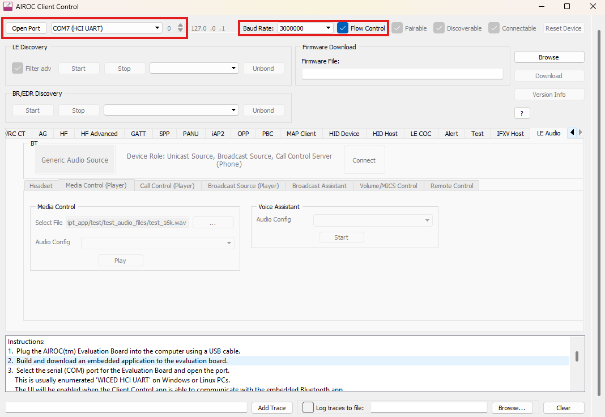

3. **Start Scanning**:
   - In **LE Discovery**, enable the advertising filter and UUID filter for ASCS UUID (`0x184E`).
   - Press **Start** and wait for headset device discovery.
   - Press **Stop** after target device appears.

   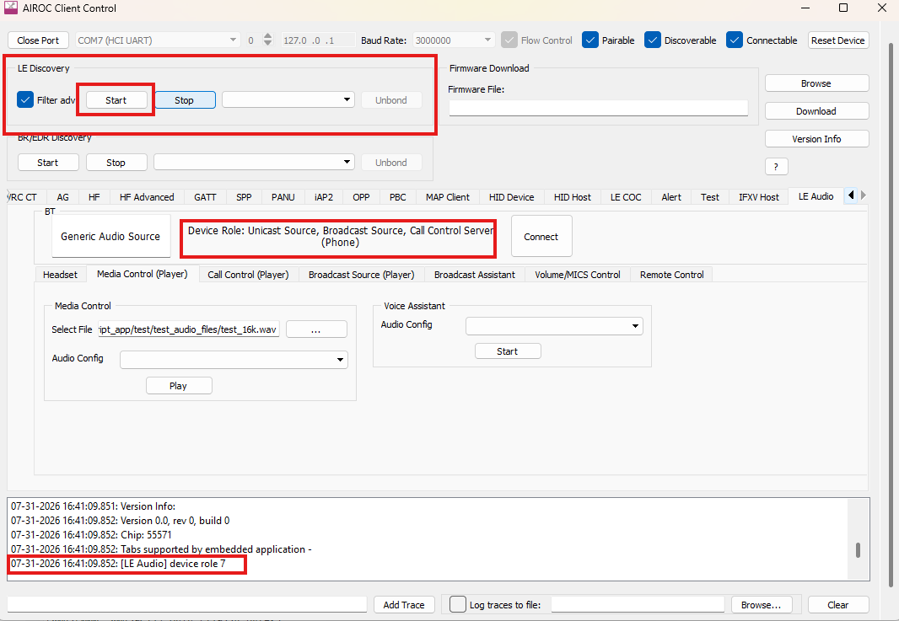

4. **Connect to Headset Device**:
   - Select discovered headset (for example, **LeAudioHS**).
   - Press **Connect** to establish ACL connection.

   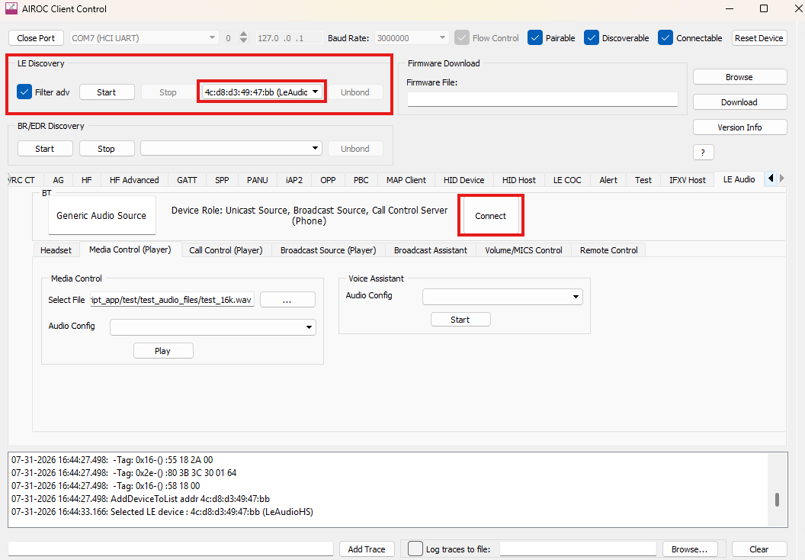

5. **Discover Services**: Wait for GATT discovery and app-ready event.
6. **Disconnect**: Press **Disconnect** to terminate ACL connection.
7. **Reconnect**: Press **Connect** to re-establish ACL connection.
8. **Unpair Device**: Press **Unbond** to remove bonding information and disconnect.

   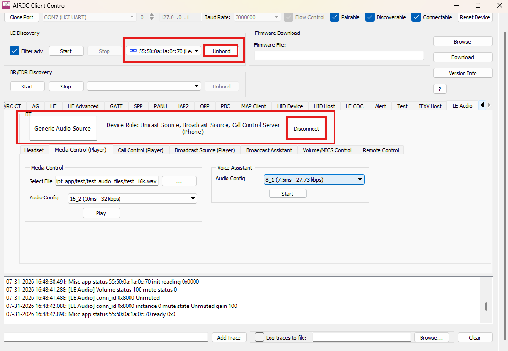

#### First Successful Stream
Use this sequence for the fastest end-to-end validation with LE Audio Headset:

1. On the headset board, open `<headset_com_port>` at `3000000` baud in ClientControl.
2. Open the **LE Audio** tab, press **Start Adv**, and confirm the log shows advertising started successfully, for example `adv state 3`.
3. On the player board, open `<player_com_port>` at `3000000` baud in ClientControl.
4. In the player LE Audio UI, enable the advertising filter, start scanning, select **LeAudioHS**, and connect.
5. In **Media Control**, select an audio config (for example `48_2` or `32_2`).
6. Choose a WAV file from `bluetooth_apps\libraries\COMPONENT_audio_module\test_audio_files` with a sample rate that matches the selected audio config, then press **Play**.
7. Listen on wired earphones connected to the headset board audio output path.
8. Verify success in logs by looking for entries such as `CIS established` on the player side and `ASE state: Streaming` on the headset side.

#### Coordinated Set (Stereo Earbuds) Operation

##### Discover and Connect to Stereo Earbuds
1. Start scanning from ClientControl.
2. Identify devices with matching SIRK (same coordinated set).
   Both set members must use the same SIRK value.
   Using the same SIRK type across set members is recommended for consistency,
   but mixed SIRK type settings are allowed and should be handled by peer devices.
3. Connect to first earbud.
4. Application scans for second earbud automatically.
5. Connection timeout is 10 seconds (`LEPL_CSIS_SET_MEMBER_DISCOVERY_TIMEOUT_IN_SEC`).
6. Optional set lock can be requested before streaming (not currently integrated with GATT operations).
7. Start streaming to both earbuds.

##### CSIS Lock States
- **Unlocked**: Set members can accept other sources.
- **Lock in Progress**: Application is requesting lock on set members.
- **Locked**: Exclusive set access granted.
- **Unlock in Progress**: Application is releasing lock.

#### Features in Unicast Mode
- Media streaming (music/audio files)
- Bidirectional audio for voice calls
- Volume control on sink devices
- Microphone audio reception from sink
- Coordinated set control for stereo earbuds
- Media playback control (play/pause)
- Telephony call control (answer/terminate/hold)

### Media

#### Supported Media Operations
- **Play**
- **Pause**

#### Media Player Information
- **Player Name**: Configurable (max 20 characters)
- **Track Title**: Current track title (max 20 characters)
- **Track Duration**: Total track length
- **Track Position**: Current playback position
- **Playback Speed**: Current playback speed
- **Media State**: Playing, Paused, Stopped, Seeking
- **Playing Order**: Single, Repeat, Shuffle, and others
- **Content Control ID**: Unique content identifier

#### Media Streaming
1. **Start Media Streaming**:
   - Select audio config from **Audio Config** (48_2_2 or 48_4_2 preferred for media).
   - Click `...` to select local audio file.
    - Choose a WAV file sampled at the selected codec rate.
   - Sample files location:

     ```text
     bluetooth_apps\libraries\COMPONENT_audio_module\test_audio_files
     ```

    - Quick-start examples:
       - `test_48k.wav` for 48 kHz media configurations
       - `test_32k.wav` for 32 kHz media or microphone validation
    - The WAV sample rate must match the selected **Audio Config**.
    - Audio is heard on the connected headset board, not on the player board itself.
    - Verify streaming success in logs by looking for entries such as `CIS established` and `ASE state: Streaming`.

   - Press **Play**.

   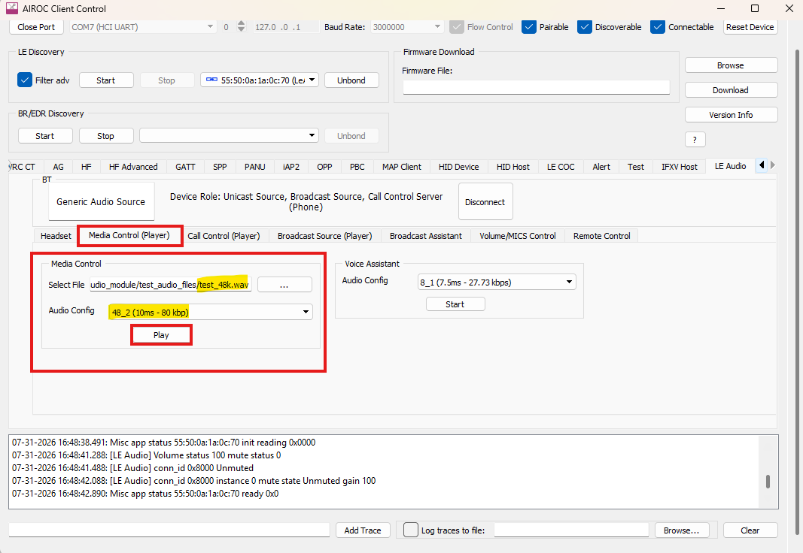

2. **Stop Media Streaming**:
   - Press **Pause**.

   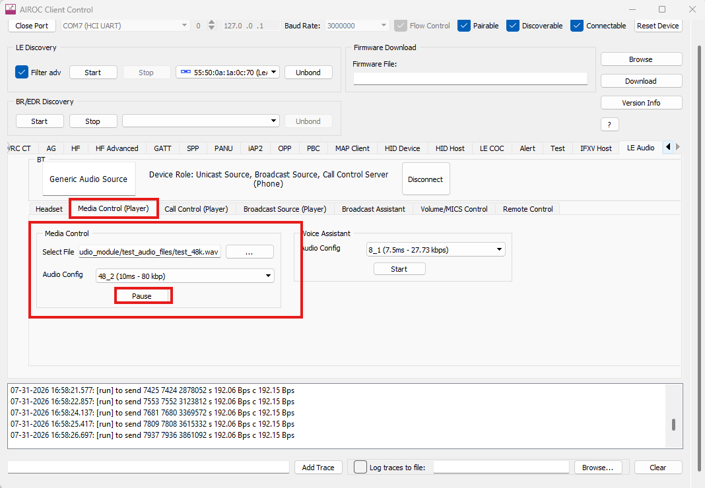

### Microphone

#### Unidirectional Microphone
1. **Start Microphone Streaming**:
   - Select audio config from **Audio Config** (24_2_2 or 32_4_2 preferred for microphone).
   - Press **Start**.

   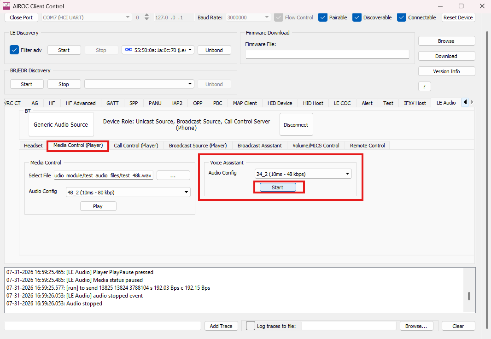

2. **Stop Microphone Streaming**:
   - Press **Stop**.

   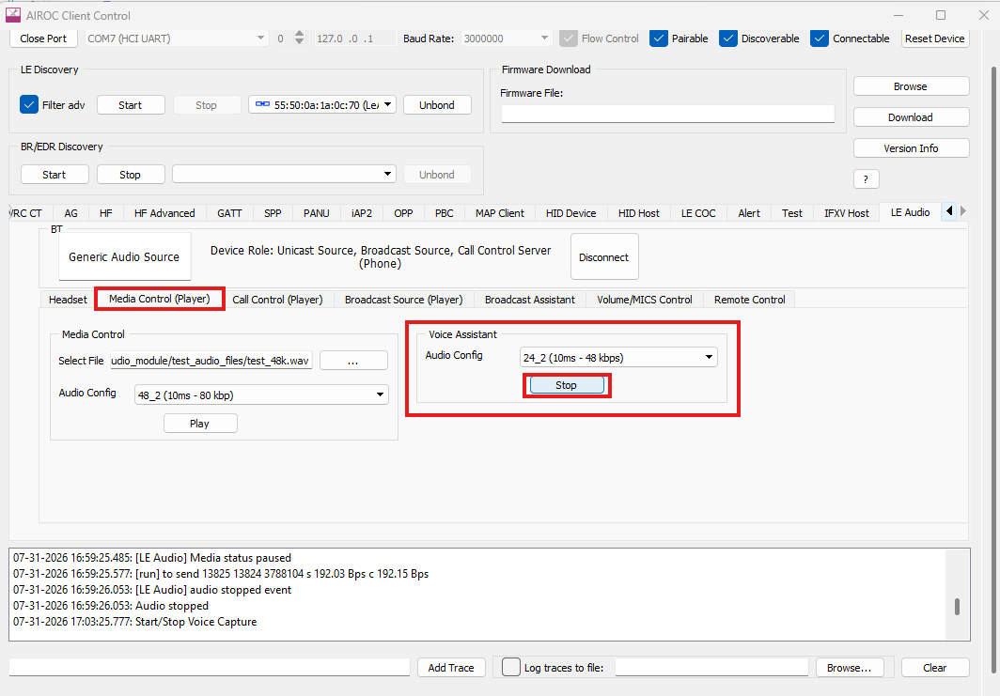

#### Bidirectional Microphone
1. **Start Bidirectional Microphone Streaming**:
   - Select input and output configs from **Audio Config** (24_2_2 or 32_4_2 preferred).
   - **In Audio Config**: outgoing stream configuration.
   - **Out Audio Config**: incoming stream configuration.
   - Press **Start**.

   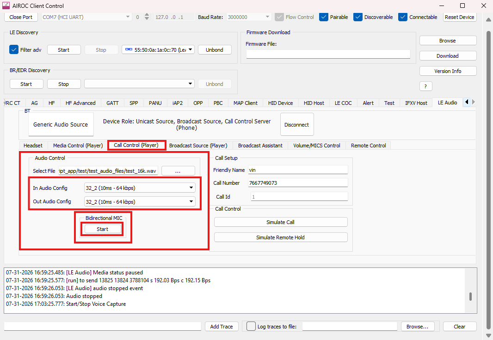

2. **Stop Bidirectional Microphone Streaming**:
   - Press **Stop**.

   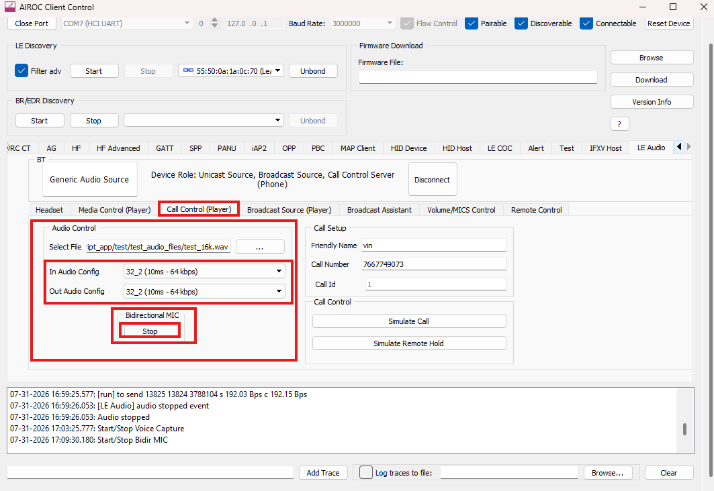

### Call Control

#### Supported Call Operations
- **Accept Call**
- **Terminate Call**
- **Hold Call**
- **Retrieve Call**
- **Originate Call**
- **Join Calls** (if supported)

#### Call Features
- **Bearer Provider Name**: Configurable (max 50 characters)
- **Uniform Caller Identifier (UCI)**: Max 50 characters
- **URI Schemes Supported**: Call address formats
- **Signal Strength**: 0 to 100
- **Call States**: Incoming, Alerting, Active, Held, Remotely Held
- **Termination Reasons**: Normal, Busy, No Answer, and others
- **Incoming Call with URI**: Caller ID information
- **Friendly Name**: Call-specific label (max 50 characters)

#### Call State Transitions
1. **Incoming Call**:
   - Application receives incoming call event.
   - If peer supports in-band ringtone, ringtone streaming starts.
   - Otherwise, sink is notified of incoming call.
2. **Accept Call**:
   - Transition from incoming/alerting to active.
   - Conversational audio context is selected.
3. **Active Call**:
   - Bidirectional audio streaming.
4. **Terminate Call**:
   - End call with termination reason.
   - Release audio streams.
   - Return to idle or previous state.

#### Call Control Operations
1. **Simulate Incoming Call**:
   - Click `...` to select local ringtone file (32 kHz sampling expected).
   - Sample files location:

     ```text
     bluetooth_apps\libraries\COMPONENT_audio_module\test_audio_files
     ```

   - Select input/output audio configs (24_2_2 or 32_4_2 preferred).
   - Enter **Friendly Name** and **Call Number**.
   - Press **Simulate Call**.

   

2. **Simulate Remote Hold**:
   - Press **Simulate Remote Hold**.

   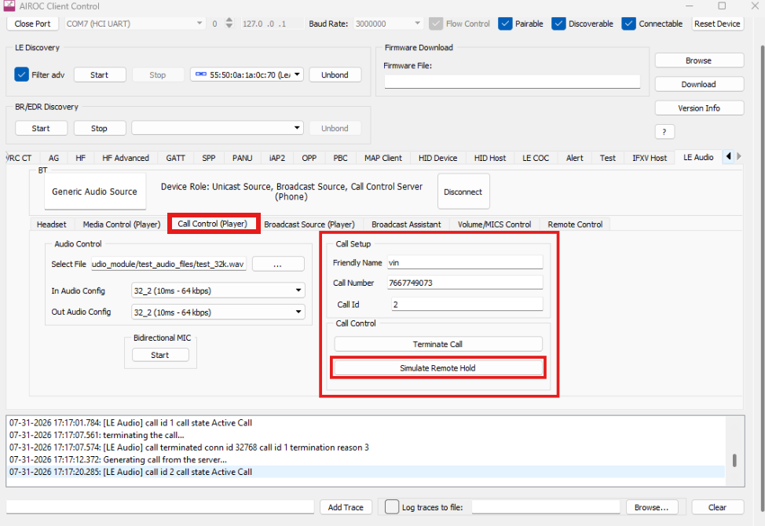

3. **Simulate Remote Retrieve**:
   - Press **Remote Retrieve**.

   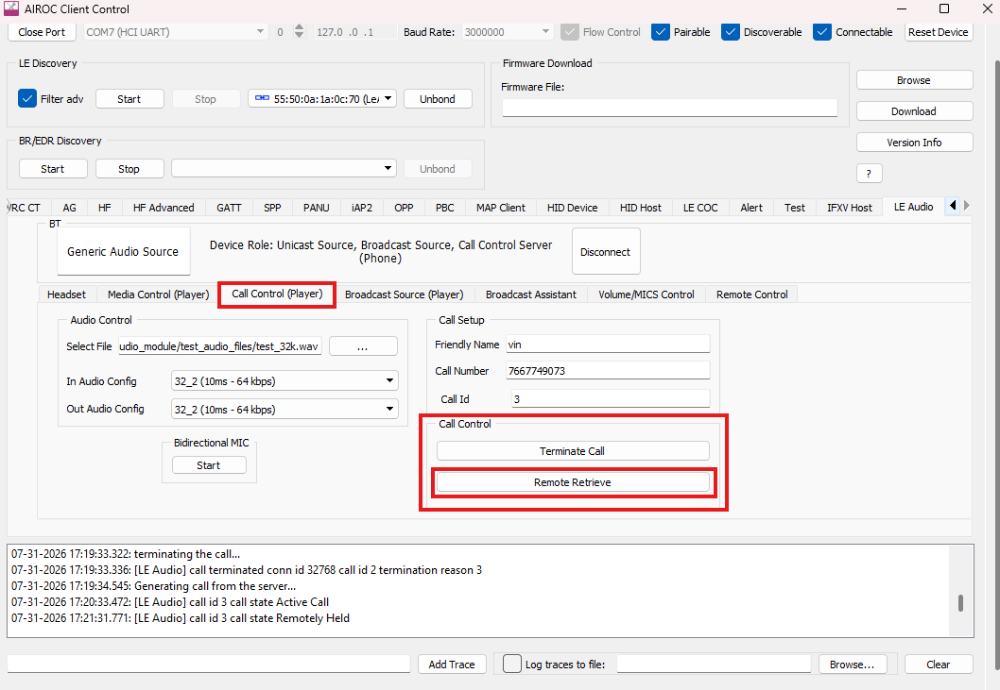

4. **Simulate Terminate Call**:
   - Press **Terminate Call**.

   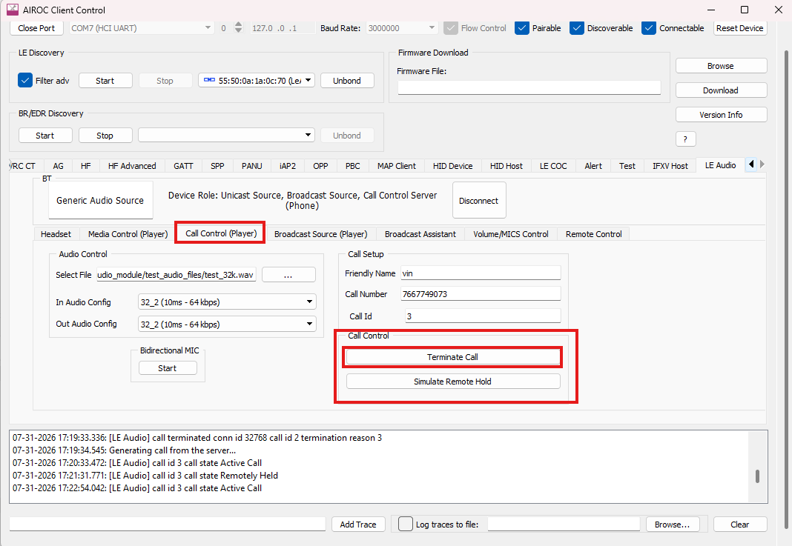

### Controlling Sink Microphones
1. **Mute Microphone**:
   - Press **Mute MICP** to mute all microphones on sink.
2. **Unmute Microphone**:
   - Press **Unmute MICP** to unmute all microphones on sink.

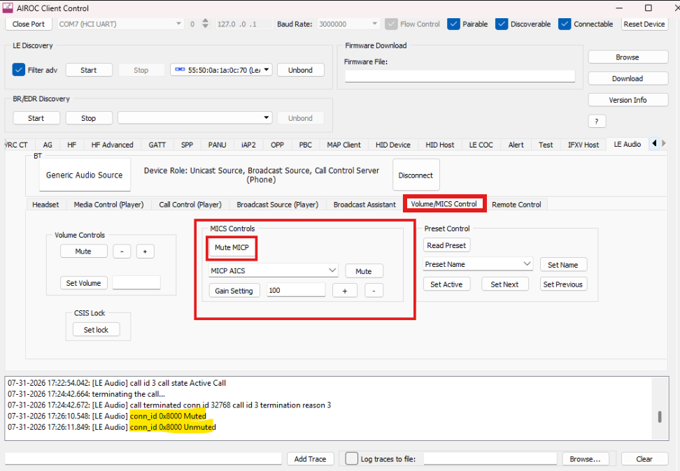

### Audio Input Control Service (AICS)
1. **Mute Individual Input**:
   - Select target input from **AICS Description**.
   - Press **Mute**.
2. **Unmute Individual Input**:
   - Select target input from **AICS Description**.
   - Press **Unmute**.
3. **Set Input Gain**:
   - Select target input from **AICS Description**.
   - Gain operations include Set, Increment, and Decrement.
   - Enter absolute gain in **Gain Setting** and press **Gain Setting**.
   - Use **+** or **-** for step adjustment.


### Volume Control Service (VCS)
1. **Set Volume**:
   - Enter value in **Volume Setting** and press **Set Volume**.
   - Use **+** or **-** for one-step adjustment.
2. **Mute/Unmute**:
   - Press **Mute** to mute overall sink volume.
   - Press **Unmute** to restore volume.


### Hearing Aid Preset Control
1. **Read Preset**:
   - Press **Read Preset**.
2. **Set Active Preset**:
   - Choose preset in **Preset Selection**.
   - Press **Set Active**, **Set Next**, or **Set Previous**.
3. **Set Preset Name**:
   - Choose preset in **Preset Selection**.
   - Enter value in **Preset Name** and press **Set Preset Name**.

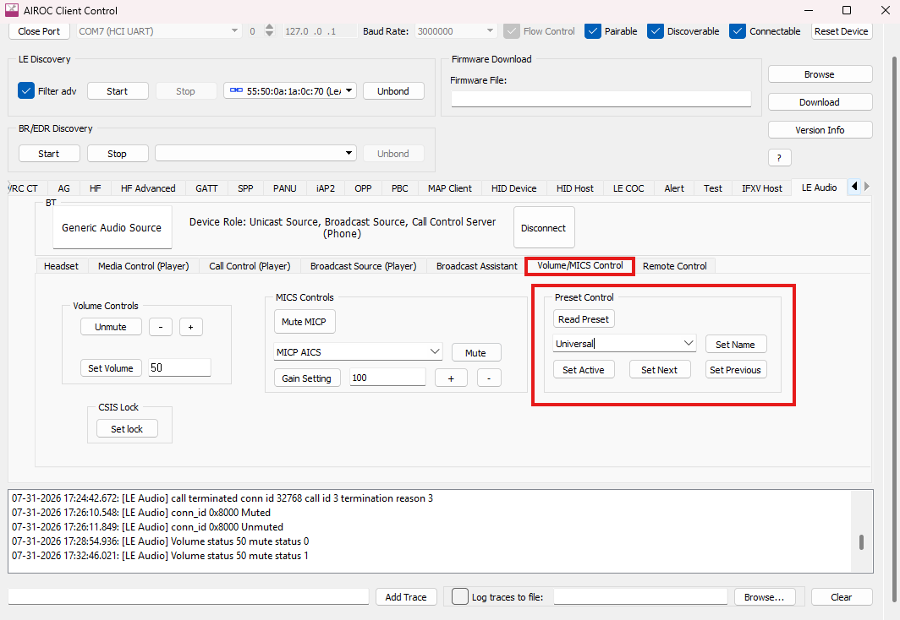

### Broadcast Source Mode (Auracast&#8482;)

#### Setup
1. **Build and Program**: Flash LEPL to the AIROC&#8482; board.
2. **Open ClientControl**:
   - Launch ClientControl on your PC.
   - Open the **WICED HCI** port.
   - Use BSP default `HCI_UART_DEFAULT_BAUD` (typically `3000000` or `115200`).
   - Select COM port and click **Open Port**.

   

3. **Configure Broadcast**:
   - Select **Audio Config** (48_2_2 or 48_4_2 preferred for media).
   - Click `...` to select local audio file.
   - Choose a WAV file sampled at the selected codec rate, for example `test_48k.wav`.
   - Sample files location:

     ```text
     bluetooth_apps\libraries\COMPONENT_audio_module\test_audio_files
     ```

    - Select **Channel Count** (`Mono` or `Stereo`).
   - Select **BIS Count** (1 or 2).
   - Enter **Broadcast Id**.
   - Enable **Encrypt BIS** for encrypted streaming.
   - Enter **Broadcast Code** (UTF-8) for encrypted streaming.

   

4. **Start Broadcasting**:
   - Press **Start Broadcast**.
   - Broadcast ID and stream information are advertised.

   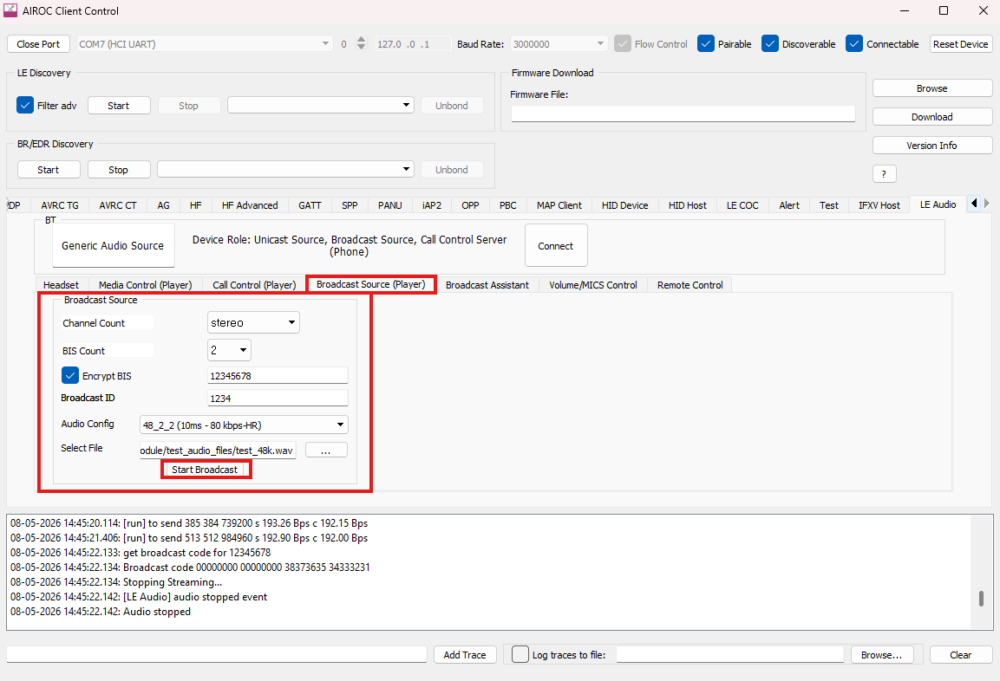

5. **Sink Synchronization**:
   - Nearby sinks can discover and synchronize.
   - Encrypted broadcasts require correct broadcast code.

6. **Stop Broadcasting**:
   - Press **Stop Broadcast**.

   

#### Broadcast Encryption Support
- Encrypted broadcast audio stream support
- Broadcast code configuration via ClientControl
- AES-CCM encryption for secure transmission

### Using BTSpy for Debugging
1. Launch **BTSpy**.
2. Connect to the device HCI UART port.
3. View real-time protocol/application traces.
4. Analyze LE events, GATT operations, and audio stream activity.

## Configuration Parameters

### Audio Configuration
The application supports these LC3 audio configurations:

| Config | Sampling Rate | Frame Duration | Octets/Frame | Use Case |
| :--- | :--- | :--- | :--- | :--- |
| 8_1_1 | 8 kHz | 7.5 ms | 26 | Low quality voice |
| 8_2_1 | 8 kHz | 10 ms | 30 | Low quality voice |
| 16_1_1 | 16 kHz | 7.5 ms | 30 | Standard voice |
| 16_2_1 | 16 kHz | 10 ms | 40 | Standard voice |
| 24_1_1 | 24 kHz | 7.5 ms | 45 | High quality voice |
| 24_2_1 | 24 kHz | 10 ms | 60 | High quality voice |
| 32_1_1 | 32 kHz | 7.5 ms | 60 | High quality audio |
| 32_2_1 | 32 kHz | 10 ms | 80 | High quality audio |
| 48_1_1 | 48 kHz | 7.5 ms | 75 | High fidelity music |
| 48_2_1 | 48 kHz | 10 ms | 100 | High fidelity music |
| 48_3_1 | 48 kHz | 7.5 ms | 90 | Very high fidelity |
| 48_4_1 | 48 kHz | 10 ms | 120 | Very high fidelity |

### Memory Configuration
- **Heap Size**: 0x1000 (4 KB app heap)
- **BT Stack Heap**: 12 KB
- **Audio TX Buffer**: 14,336 bytes (configurable)
- **Audio TX Watermark**: 70% (configurable)

### Connection Parameters
- **Maximum Connections**: 2 simultaneous ACL connections
- **Connection Interval**: `80 * 1.25 ms = 100 ms` (configurable)
- **Connection Latency**: 0
- **Supervision Timeout**: 700 ms

## Application Architecture

### Main Components
- **lepl_main.c**: Application entry point and stack initialization
- **lepl_btmgr.c**: Bluetooth management event handling
- **lepl_gatt.c**: GATT database and connection management
- **lepl_ascs.c**: Audio Stream Control Service client implementation
- **lepl_cis.c**: Connected Isochronous Stream handling
- **lepl_bis.c**: Broadcast Isochronous Stream handling
- **lepl_isoc.c**: Generic isochronous event handling
- **lepl_isoc_offload.c**: Audio offload path handling
- **lepl_pacs.c**: Published Audio Capabilities Service client
- **lepl_vcs.c**: Volume Control Service client
- **lepl_mics.c**: Microphone Control Service client
- **lepl_csis.c**: Coordinated Set Identification Service client
- **lepl_has.c**: Hearing Aid Service client
- **lepl_mcs.c**: Media Control Service server
- **lepl_tbs.c**: Telephone Bearer Service server
- **lepl_cap.c**: Common Audio Profile implementation
- **lepl_gmap.c**: Gaming Audio Profile implementation
- **lepl_nvram.c**: Non-volatile memory management
- **lepl_rpc.c**: RPC communication with ClientControl

### GATT Database Structure
The GATT database includes handles for:
- Generic Attribute Service (0x0001 to 0x000A)
- Generic Access Service (0x0020 to 0x0026)
- Generic Media Control Service (0x0150 to 0x0175)
- Generic Telephone Bearer Service (0x0220 to 0x024C)
- Telephony Media Audio Service (0x0260 to 0x0262)
- Gaming Media Audio Service (0x0300 to 0x0306)
- Device Information Service (0x0310 to 0x0318)

### Audio Mode State Machine
The application manages the following audio modes:

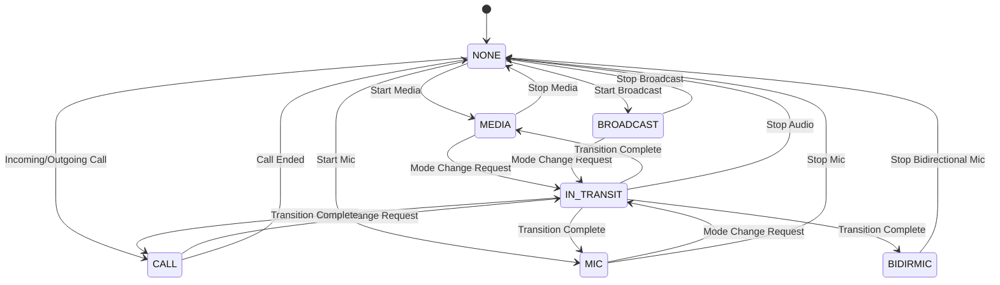
```mermaid
stateDiagram-v2
    [*] --> NONE
    NONE --> MEDIA: Start Media
    NONE --> CALL: Incoming/Outgoing Call
    NONE --> MIC: Start Mic
    NONE --> BROADCAST: Start Broadcast

    MEDIA --> IN_TRANSIT: Mode Change Request
    CALL --> IN_TRANSIT: Mode Change Request
    MIC --> IN_TRANSIT: Mode Change Request
    BROADCAST --> IN_TRANSIT: Mode Change Request

    IN_TRANSIT --> MEDIA: Transition Complete
    IN_TRANSIT --> CALL: Transition Complete
    IN_TRANSIT --> MIC: Transition Complete
    IN_TRANSIT --> BIDIRMIC: Transition Complete
    IN_TRANSIT --> NONE: Stop Audio

    MEDIA --> NONE: Stop Media
    CALL --> NONE: Call Ended
    MIC --> NONE: Stop Mic
    BIDIRMIC --> NONE: Stop Bidirectional Mic
    BROADCAST --> NONE: Stop Broadcast
```

#### Audio Modes
- **NONE**: No active audio
- **BROADCAST**: Broadcast audio transmission (Auracast&#8482;)
- **MEDIA**: Media streaming to sink (music/audio files)
- **MIC**: Microphone streaming from sink (voice capture)
- **BIDIRMIC**: Bidirectional microphone (conversational)
- **CALL**: Telephony call (bidirectional with call control)
- **IN_TRANSIT**: Transitioning between modes

## Troubleshooting

### Cannot Discover Sink Devices
- Verify sink devices are advertising.
- Ensure scanning is started via ClientControl.
- Check scan parameters and scan duration.
- Verify sink devices are within range.
- Enable UUID filter for ASCS UUID.

### Cannot Connect to Sink Device
- Verify Bluetooth is enabled on both devices.
- Check sink device name visibility during scanning.
- Ensure no severe RF interference.
- Verify connection parameter compatibility.

### No Audio Playback
- Verify audio stream establishment (check BTSpy logs).
- Check sink volume (may be muted or set to 0).
- Ensure sink supports selected audio configuration.
- Verify CIS connection establishment (ISO logs).
- Confirm ASE states transitioned to Streaming.
- Ensure wired earphones are connected to the headset board audio output path.
- If there is no audio callback, ensure the wired earphones are connected to
   `C29` (right mic path), not the other mic connector.
- Confirm the WAV sample rate matches the selected **Audio Config**.

### Player Logs `StartMic: Device not ready to play`
- Click **Disconnect** and **Unbond** on both boards.
- Click **Reset Device** on both boards in ClientControl.
- Re-open the correct COM ports if needed.
- Restart the quick-start sequence from advertising and scanning.

### Service Discovery Fails
- Ensure GATT MTU configuration is valid.
- Verify sufficient heap memory.
- Confirm sink supports required services.
- Review BTSpy logs for GATT errors.

### Coordinated Set Issues
- **Both earbuds not connecting**:
   - Verify matching SIRK settings on both earbuds.
   - Ensure both earbuds use the same SIRK value.
   - Using the same SIRK type (both plain or both encrypted) is recommended,
      but it should not be enforced.
  - Check set member discovery timeout (10 seconds).
  - Ensure both earbuds are in pairing mode.
- **Set lock fails**:
  - Verify CSIS lock support on sinks.
  - Check lock timeout.
  - Ensure both set members are connected.

### Audio Quality Issues
- **Choppy Audio**:
  - Check connection interval alignment (7.5/10 ms multiples).
  - Verify SDU interval matches audio configuration.
  - Increase audio buffer size if needed.
   - Check that wired earphones are connected correctly.
  - Check for RF interference.
   - In noisy RF environments, use an external antenna and connect it to `J3`.
- **Audio Latency**:
  - Adjust `CTLR_DELAY`.
  - Verify presentation delay settings.
  - Check ISO stream parameters (RTN, MTL).

### Call Control Issues
- **Cannot answer call**:
  - Verify sink supports TBS/GTBS client.
  - Check call state transitions in BTSpy.
  - Ensure conversational context support on sink.
- **No ringtone audio**:
  - Verify sink supports in-band ringtone.
  - Check ringtone stream establishment.
  - Review PACS supported contexts on sink.

### Debug Traces
Enable additional debug output by ensuring:

```c
#define WICED_BT_TRACE_ENABLE
```

View traces using BTSpy or a serial terminal at configured baud rate.

### BTSpy Log Analysis

#### Key Events to Monitor
1. **Connection Events**:
   - `LE_META_EVENT` -> `LE_CONNECTION_COMPLETE`
2. **GATT Discovery**:
   - `ATT_READ_BY_GROUP_TYPE_REQ` / `RSP`
3. **ASE Configuration**:
   - ASE control point writes (Config Codec, Config QoS, Enable, and others)
   - ASE state notifications
4. **CIS Establishment**:
   - `LE_META_EVENT` -> `LE_CIS_ESTABLISHED`
5. **ISO Data**:
   - `ISO_DATA_PACKET` (if using HCI transport)

## NVRAM Data Storage
The application uses simulated NVRAM (host-side) for storing:
- Bonding information
- GATT database hash
- Client Characteristic Configuration Descriptors (CCCD)
- Device pairing keys
- Service discovery cache
- Identity Resolving Key (IRK)
- Coordinated set configuration

Set `SIMULATED_NVRAM=1` in the `Makefile` to enable client-side NVRAM emulation.

## Performance Characteristics
- **Audio Latency**: Configurable via `CTLR_DELAY` (default 35 ms)
- **Maximum Connections**: 2 simultaneous ACL connections
- **Connection Interval**: 100 ms (configurable, aligned with ISO intervals)
- **Advertising Interval**:
  - High duty: 30 to 60 ms
  - Low duty: 1024 ms
- **Scan Interval/Window**:
  - High duty: default BSP values
  - Low duty: default BSP values

## Audio Transcoding Mode
When `AUDIO_TRANSCODING=1` is enabled:

### Architecture
```text
[BR/EDR Source] --A2DP/SBC--> [LEPL] --LE Audio/LC3--> [LE Sink]
     Phone                    Gateway                  Earbuds
```

### Features
- Receives A2DP audio from BR/EDR source (phone/tablet)
- Decodes SBC/AAC audio
- Encodes to LC3
- Transmits to LE Audio sink devices
- Auto play/pause based on first audio configuration

### Supported Profiles
- **A2DP Sink**: SBC decoder (AAC optional)
- **HFP Handsfree**: Voice calls with WBS
- **AVRCP Controller**: Media playback control

### Configuration
- **A2DP Max Connections**: 1
- **HFP Max Connections**: 1
- **SBC Max Bitpool**: 35
- **Buffer Depth**: 300 ms
- **Start Buffer Depth**: 50%

## More Information
- [Infineon Technologies](https://www.infineon.com)
- [ModusToolbox&#8482; Software](https://www.infineon.com/modustoolbox)
- [AIROC&#8482; Bluetooth&#174; SDK](https://github.com/Infineon/btsdk-docs)
- [LE Audio Specifications](https://www.bluetooth.com/specifications/specs/le-audio/)
- [Auracast&#8482; Information](https://www.bluetooth.com/auracast/)
- [Bluetooth SIG Generic Audio Framework](https://www.bluetooth.com/specifications/specs/generic-audio-framework/)

## License
This application is provided under the Apache License 2.0. See LICENSE file for details.

---

Copyright (c) 2024 Infineon Technologies. All rights reserved.
